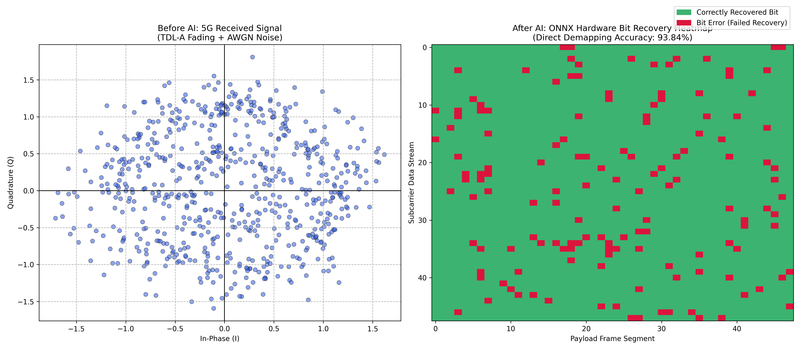
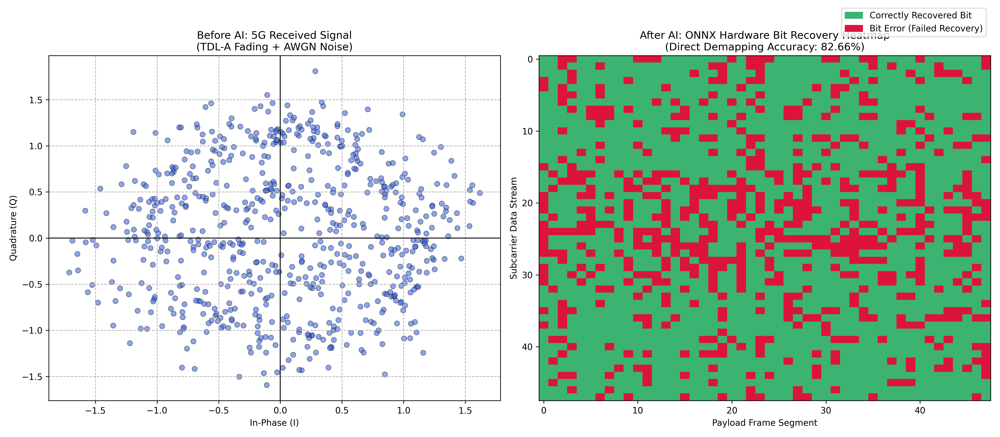

# End-to-End AI-Native 5G SISO Receiver

This repository contains the design, training, and hardware deployment pipeline for a Convolutional Neural Network (CNN) intended to replace traditional 5G physical layer receiver components (channel estimation and LMMSE equalization). 

The model acts as a direct bit demapper for 16-QAM symbols transmitted over a dispersive 3GPP TDL-A fading channel. It is aggressively constrained using 8-bit Quantization-Aware Training (QAT) via Xilinx Brevitas, preparing it for hardware synthesis via the FINN compiler on a Zynq UltraScale+ ZCU104 FPGA.

## 1. System Model & Engineering Rationale
In highly dispersive TDL-A fading channels with low SNR, explicit channel estimation using DMRS pilot symbols degrades heavily. This project uses a CNN with $3 \times 3$ spatial convolutions to implicitly estimate the channel by evaluating a target data symbol alongside its adjacent neighbors.


*Above: The severely distorted 16-QAM constellation at 15dB SNR before Neural Demapping.*

## 2. Implementation Challenges & Solutions

### Challenge 1: Quantization Clipping
Initial 8-bit integer PyTorch models failed to converge. The 8-bit quantizer truncated small voltage variations to zero. 
**Solution:** Inserted `BatchNorm2d` to scale variance before quantization, immediately boosting accuracy to 92.55% on static datasets.

### Challenge 2: Dataset Generation & Memory Constraints
Generating 50,000 complex OFDM slots simultaneously caused Out-Of-Memory (OOM) exceptions. 
**Solution:** Built a sequential chunking pipeline to generate, save, and stitch `.npy` files iteratively.

### Challenge 3: Extreme Noise Fading (5dB)
At extreme noise limits, the baseline architecture lacked parametric capacity.
**Solution:** Expanded the architecture (16/32 to 32/64 filters) and utilized a `StepLR` scheduler. The V2 model achieved **82.66% global direct bit demapping accuracy**.


*Above: The final V2 Bit Recovery Heatmap showing 82.66% accuracy across a dynamic 5dB-25dB SNR range.*

## 3. Training the V2 Golden Model
To reproduce the V2 training pipeline and generate the ONNX export:
```python
python train_brevitas_golden_v2.py

###This repository contains the design, training, and hardware deployment pipeline for a Convolutional Neural Network (CNN) intended to replace traditional 5G physical layer receiver components (channel estimation and LMMSE equalization). 

The model acts as a direct bit demapper for 16-QAM symbols transmitted over a dispersive 3GPP TDL-A fading channel. It is aggressively constrained using 8-bit Quantization-Aware Training (QAT) via Xilinx Brevitas, preparing it for hardware synthesis via the FINN compiler on a Zynq UltraScale+ ZCU104 FPGA.

## 1. Environment Setup (Ubuntu 22.04/24.04)
To replicate this environment, Python 3.10 is required. 

```bash
# Create and activate virtual environment
python3.10 -m venv deeprx_env
source deeprx_env/bin/activate

# Install dependencies
pip install -r requirements.txt
